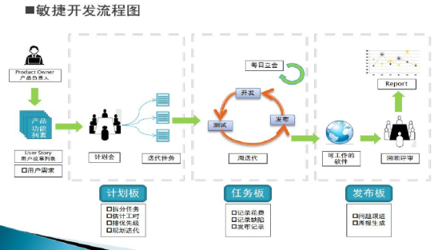
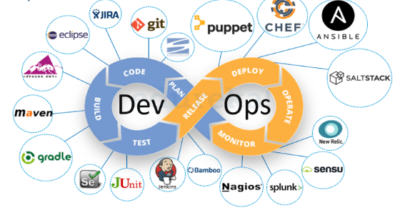
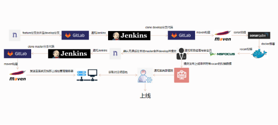
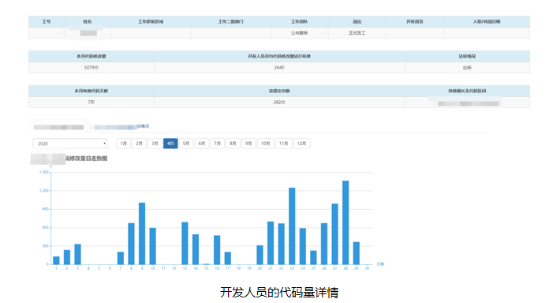

# DevOps-CICD
DevOps &amp; CICD

**开发模式**

**瀑布型**

有明确的需求，大家按照需求一步步做好规划，每一阶段工作的完成是下一阶段工作开始的前提，每一阶段都要进行严格的评审，保证各阶段的工作做得足够好时才允许进入下一阶段。这种模式一般适用于需求比较明确、to B 端的项目。

 缺点：当产品研发完成后， 到了产品测试阶段 万一发现问题 ，或者发现其无法满足市场需求， 那么就需要重新开发，甚至需要重新规划产品，这间接导致了产品延期发布的高发性与不确定性。

**敏捷开发**

**DevOps**

1.Jira（PLAN）- 用于对计划的整理与分配，并记录每个任务开发的工时，还能对任务进行不同的等级分配；

2\.Gitlab（CODE）- 代码版本管理工具，以Git为核心开发的类中心化平台，对项目进行权限控制，对分支进行策略管理；

3\.SonarQube（STATIC-SCAN） - 对sonar-scanner的扫描结果进行分析并记录；

4\. 

Jenkins - 强大的开源敏捷开发工具，可建立流水线对代码进行构建、扫描、部署等操作，拥有许多的插件；

Activit workflow

` `在Gitlab中严格按照代码版本管理办法，对代码仓库（project）进行分支策略。每个Project中必须含有master与develop分支，开发人员禁止上传代码到develop与master分支中。当develop或master（少量）分支触发上传或提交事件时，会自动推送信息至Jenkins，由Jenkins负责流水线操作。

流水线的操作包含：代码克隆、项目构建、质量扫描、应用部署、版本发布。根据项目的情况进行不同的流水线配置。

